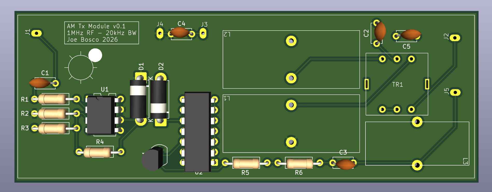

[Go Back](Hardware.md)
*May 2025*
# AM Transmitter

I haven't gotten around to fleshing out this writeup but please find a summary this project below. Check back later for more details, and don't hesitate to [reach out](Contact.md) with any questions!

**AM Transmitter Design** 
*Communication Circuits, Columbia University*
- Designed a highly efficient analog AM Transmitter focusing on modulation accuracy and signal integrity.
- Performed detailed analysis to optimize biasing and linearity, tune passive networks, and maximize efficiency.

Everything works on breadboard (complete with -12dB losses due to breadboard parasitics) but I want to have a nice PCB to port and modularize this project to various AM radio projects in the works and hopefully engineer out some of those losses caused by the testbed. 
PCB Prototyping in the works, I've been using KiCAD to throw some ideas together and am waiting on the manufacturer to get back with initial prototypes. 

