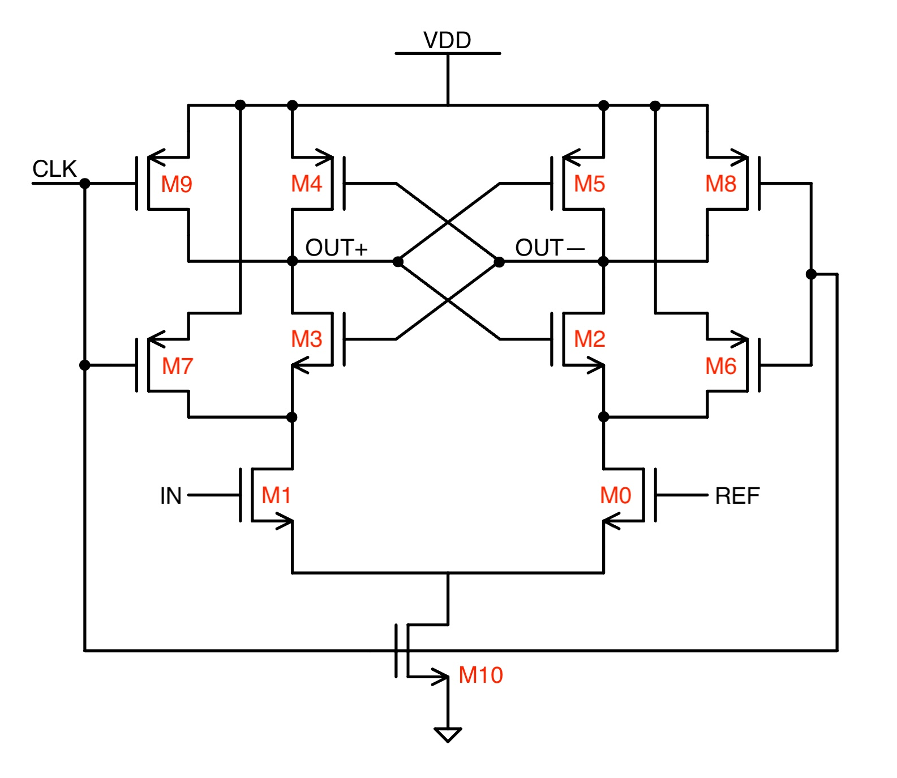

[Go Back](Hardware.md)

*May 2025*
# Successive Approximation Register Analog-Digital Converter (i.e., SAR ADC)

The SAR architecture (or SARchitecture, if you will) has [surged](https://ieeexplore.ieee.org/document/9761973) in popularity among ADC architectures. Besides achievement of high efficiency and resolution, its elegant working principle of successive approximation appeals to the computer science purist in me because it operates as a physical implementation of a binary search algorithm. Furthermore, the exact number of steps needed for a given conversion is easily determined, and with careful design, the exact timing of each conversion step can be controlled. 

This project was inspired by recent research into Wireless Sensor Networks (WSNs), in particular [this paper](https://ieeexplore.ieee.org/document/11008746) which provides a good forward-looking review. 

*Specs:*
	**CMOS Process:** 180nm
	**Sample rate:** 50kS/s - slow, but usable for WSN applications, and lets us absolutely squash the power consumption
	**Power:** <10uW
	**Base CLK:** 550kHz (N + 1 times sample rate, where N is bit count)
	**Bits per word**: 10b
		
	
	

The components of the SAR ADC are:
	**DAC** - a binary-weighted capacitor array comprising two identical branches of 10 capacitors each, and a dummy capacitor tied to the common-mode voltage to maintain symmetry. 
	**Comparator** - StrongARM dynamic regenerative latch, chosen because it draws no static power (see below).
	SR Latch
	SAR Logic Block

For the comparator, I designed a strongARM dynamic latch with the following topology:

This is a general topology for strongARM, with a few key modifications for performance. 
The latch operates in two phases:
	Reset phase: CLK=LOW, output nodes are pulled high by M6 and M7
	Evaluation phase: CLK=HIGH, one output is pulled low. Which output this is depends on the input state. 