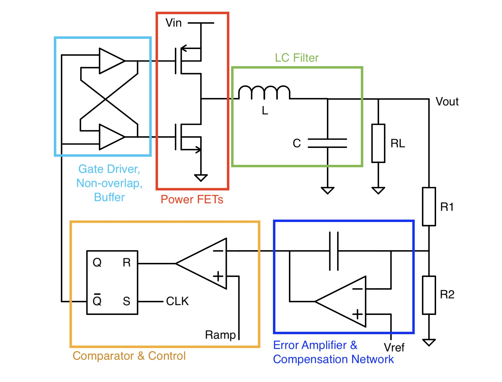

[Go Back](index.md)

*Dec. 2025*
# Integrated Buck Converter Design

Love me some power adapter. That mysterious warm black plastic brick which, turns the high voltage wall power waterfall into a trickle for our most delicate instruments. Almost like an electron bottleneck, calming down high energy signals without wasting loads of power. I've looked at power converters closely before, but usually in the context of informal power adapter teardowns, and not generally including the DC/DC buck converter ICs (e.g. TPS54302DDCR) which make those power adapters work. So I'm looking forward to seeing how it all comes together. 
#### Going into this, the main considerations are:
1. Handle a range of inputs and output voltages (1.0-1.2V in, 0.6-0.9V out)
2. The size of the inductor (target an integrated inductor ~ 10nH)
3. The voltage ripple of the output (generally, larger inductor=smaller ripple)
4. Compensation of the feedback network
5. Speed of digital control circuitry
#### The overall sequence of events in the loop, assuming steady-state operation:
1. Power FETs (the main switches) generate a PWM signal switching between GND and Vin, with the duty cycle corresponding to the conversion ratio.
2. LC Filter smooths the PWM signal into a stable output voltage proportional to the duty cycle. 
3. Voltage divider steps the output down to the reference level.
4. Error amplifier compares the output voltage to a reference and outputs the error
5. Compensation of output poles prevents unstable behavior of the loop (see below)
6. Comparator generates a PWM signal by comparing the error to a ramp (sawtooth) signal
7. SR Latch manage 
8. The gate driver comprises a series of complementary buffers, which spreads out logical effort to efficiently drive the main switches
9. Non-overlap buffer ensures non-overlap between the PWM input to the complementary power FETs (prevent shoot-through current)

With these considerations we'll base the design on the below topology. 

