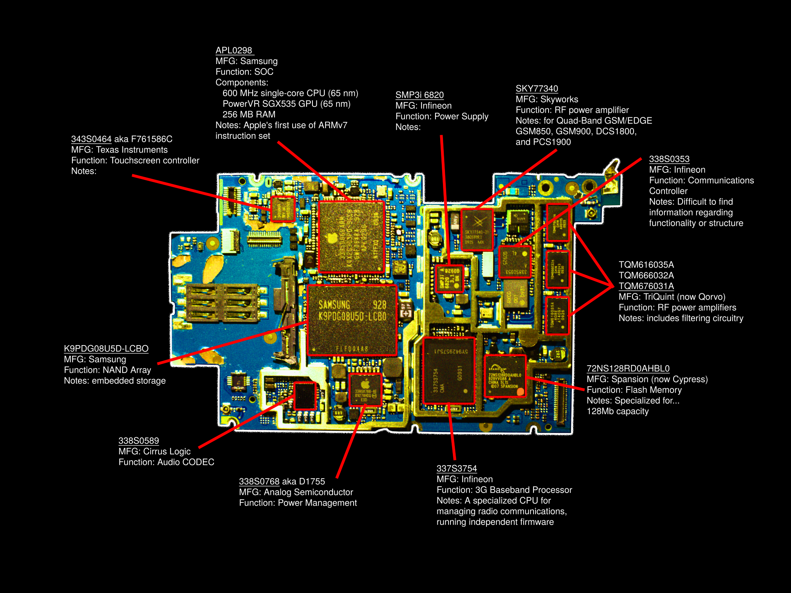

# Teardowns

	Feb. 26
//
## An Old Classic: The iPhone 3GS
I recently found an old iPhone 3GS which was my first personal device, which was a hand-me-down from my parents when I was 10 years old. Since I don't have any reason to hang onto it besides nostalgia, I figured I'd have a look inside and see what kind of components and chipset Apple was working with in 2009.  

I had a great time picking through the main board and identifying each chip in the chipset, see my diagram below. It seems like they were working mostly with 65nm CMOS technology, but there are signs of the imminent move to 45nm. 

